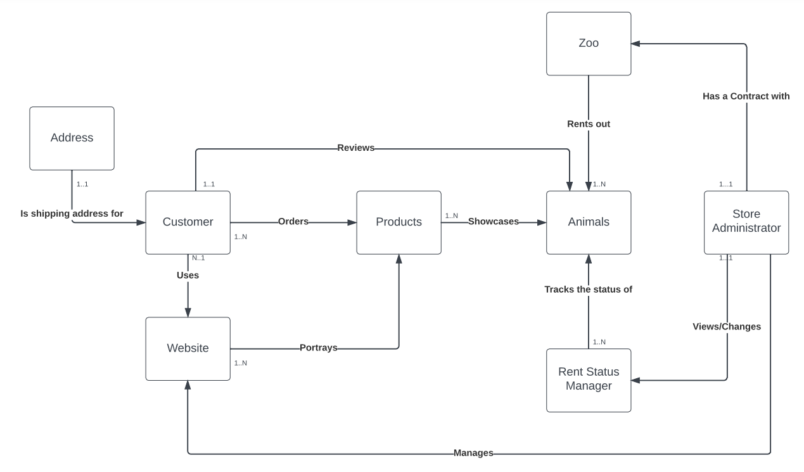
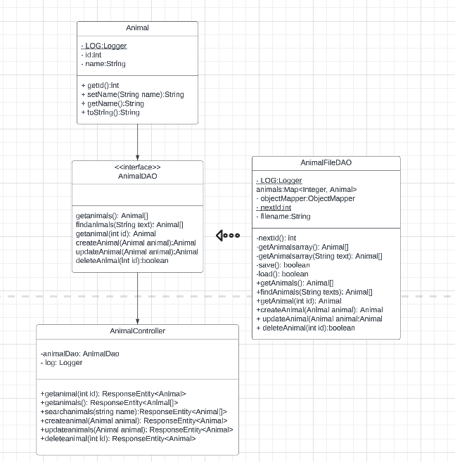
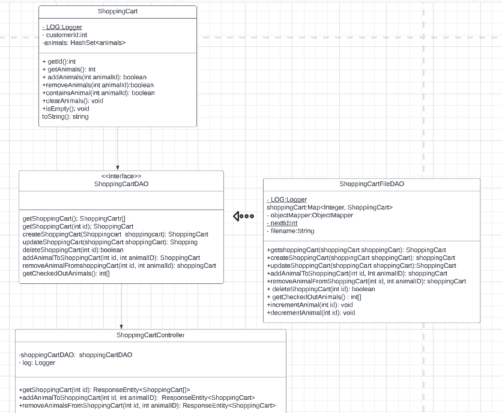
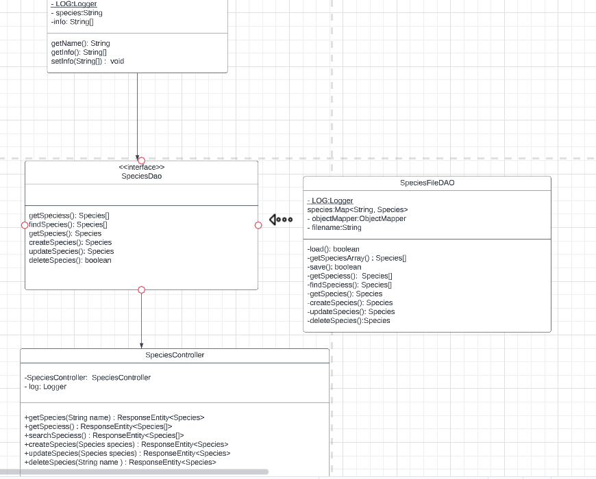
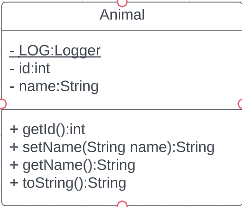
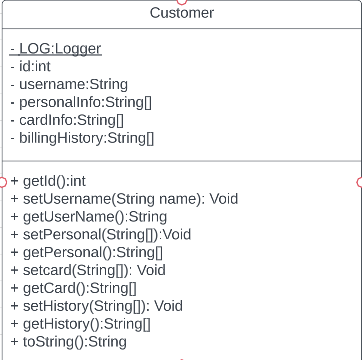
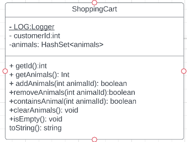
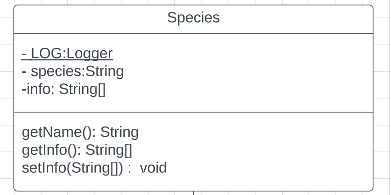
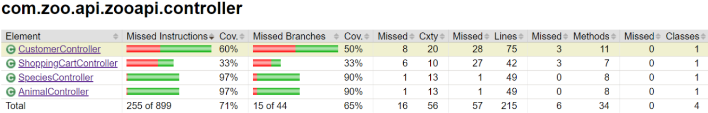
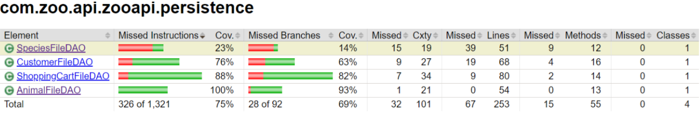

# PROJECT Design Documentation

> _The following template provides the headings for your Design
> Documentation.  As you edit each section make sure you remove these
> commentary 'blockquotes'; the lines that start with a > character
> and appear in the generated PDF in italics._

## Team Information

* Team name: 6F We Bought a Zoo
* Team members
  * Krysta Lestico
  * Aayan Sayed
  * Jack Speroni
  * Joseph O'Neil
  * Bobby Dhanoolal

## Executive Summary

We Bought a Zoo is working on the premise of a webstore where customers will be able to go into the store and rent out animals for their events. Ideally the owner of the webstore will have a contract with the zoos in order to rent out their animals. The owner will then be able to go into the webstore and edit, add, delete animals into the webstore so that the customers can view and rent. The Customers will be able to login to the webstore and view the products, add it to shopping cart, and checkout with their information. For an additional feature there is a species care list where owners can add, remove, and update species and their information as needed. Customers are able to see the full list of species available and how to care for them before purchasing. 

### Purpose
>  _**[Sprint 2 & 4]** Provide a very brief statement about the project and the most
> important user group and user goals._

A webstore that allows customers to view and rent out animals and owner to add and edit animals at will.

### Glossary and Acronyms
> _**[Sprint 2 & 4]** Provide a table of terms and acronyms._

| Term | Definition |
|------|------------|
| SPA | Single Page |

## Requirements

This section describes the features of the application.

> _In this section you do not need to be exhaustive and list every
> story.  Focus on top-level features from the Vision document and
> maybe Epics and critical Stories._

### Definition of MVP
> _**[Sprint 2 & 4]** Provide a simple description of the Minimum Viable Product._

The minimum viable product will have the customers being able to view basic information about the animals (name, price, species), the owner to be able to change the animals that are listed in the product list and for both owner and customer to be able to log in with their username and not be able to see the other's side of the webstore. The customers are able to checkout with the items in their shopping cart. 

### MVP Features
>  _**[Sprint 4]** Provide a list of top-level Epics and/or Stories of the MVP._

 Epics: animal or product, customer, owner, species, shopping cart
  Top-Level Stories: Checkout, add/remove/update product, browse products, product history, targeted species care information 

### Enhancements
> _**[Sprint 4]** Describe what enhancements you have implemented for the project._

Our enhancement for this project was the addition of species care information. For every animal that is listed in the product list, there will be a species care information for the species of that animal available for customer to look over. Owners will have the ability to add, remove, and update species as needed and this includes their specific care information as well. The owner can add as many or as little tidbits that is needed in order to allow the customer the ability to care for the animals well. There is also the ability for the customers to see a targeted list of species that is based off of their purchase history so that they can see care information for every species that they have bought. 

## Application Domain

This section describes the application domain.

> _**[Sprint 2 & 4]** Provide a high-level overview of the domain for this application. You
> can discuss the more important domain entities and their relationship
> to each other._

In the domain model the customers can order the product through using the website. The owner/store admin can view can manage the website which will show the product.

## Architecture and Design

This section describes the application architecture.

 -->

### Summary

The following Tiers/Layers model shows a high-level view of the webapp's architecture.

The e-store web application, is built using the Model–View–ViewModel (MVVM) architecture pattern. 

The Model stores the application data objects including any functionality to provide persistance. 

The View is the client-side SPA built with Angular utilizing HTML, CSS and TypeScript. The ViewModel provides RESTful APIs to the client (View) as well as any logic required to manipulate the data objects from the Model.

Both the ViewModel and Model are built using Java and Spring Framework. Details of the components within these tiers are supplied below.

### Overview of User Interface

This section describes the web interface flow; this is how the user views and interacts
with the e-store application.

> _Provide a summary of the application's user interface.  Describe, from
> the user's perspective, the flow of the pages in the web application._

### View Tier
> _**[Sprint 4]** Provide a summary of the View Tier UI of your architecture.
> Describe the types of components in the tier and describe their
> responsibilities.  This should be a narrative description, i.e. it has
> a flow or "story line" that the reader can follow._

> _**[Sprint 4]** You must  provide at least **2 sequence diagrams** as is relevant to a particular aspects 
> of the design that you are describing.  For example, in e-store you might create a 
> sequence diagram of a customer searching for an item and adding to their cart. 
> As these can span multiple tiers, be sure to include an relevant HTTP requests from the client-side to the server-side 
> to help illustrate the end-to-end flow._

> _**[Sprint 4]** To adequately show your system, you will need to present the **class diagrams** where relevant in your design. Some additional tips:_
 >* _Class diagrams only apply to the **ViewModel** and **Model** Tier_
>* _A single class diagram of the entire system will not be effective. You may start with one, but will be need to break it down into smaller sections to account for requirements of each of the Tier static models below._
 >* _Correct labeling of relationships with proper notation for the relationship type, multiplicities, and navigation information will be important._
 >* _Include other details such as attributes and method signatures that you think are needed to support the level of detail in your discussion._

### ViewModel Tier
> _**[Sprint 4]** Provide a summary of this tier of your architecture. This
> section will follow the same instructions that are given for the View
> Tier above._

> _At appropriate places as part of this narrative provide **one** or more updated and **properly labeled**
> static models (UML class diagrams) with some details such as critical attributes and methods._
> 

### Model Tier
> _**[Sprint 2, 3 & 4]** Provide a summary of this tier of your architecture. This
> section will follow the same instructions that are given for the View
> Tier above._

The model tier is responsible for controlling the data structure and updating the view (persistence). In our case the animal model defines the attributes required of the object and has getters and setters for each attribute. The same thing is similarly applied for the owner and customer object where specific functionality is also added when needed.

> _At appropriate places as part of this narrative provide **one** or more updated and **properly labeled**
> static models (UML class diagrams) with some details such as critical attributes and methods._
> 

 -->

## OO Design Principles
> _**[Sprint 2, 3 & 4]** Discuss at least **4 key OO Principles** in your current design. This should be taken from your work in "Adherence to Architecture and Design Principles" that you have completed in a previous Sprint. Be sure to include any diagrams (or clearly refer to ones elsewhere in your Tier sections above) to support your claims._

Law of Demeter

  The law of Demeter or the principle of least knowledge is an important design guideline for developing software. The guidelines outline how the different units of the software should interact with each other. It is part of the GRASP design principles which are designed to standardize the use of object oriented programming. Law of Demeter in specific deals with the range that a class can talk too and make sure that it is not reaching too far.

  Each unit should only know what it absolutely needs to function
  Limiting the knowledge each unit knows about others it allows for a more secure backend.
  Each unit should only talk to other units it considers friendly or has a relationship with
  Each unit of the application can only communicate with other immediate units.

  The Law Of Demeter follows the principle of “information hiding” where each individual assumes as little as possible about the other units of the application. It boils down to each unit possessing only the information and resources necessary for their task.

  This principle is applied to our project because there is a similar level of information hiding with the controller, the model approach. There are interfaces that abstract the objects and keep things on a need-to-know basis. By using this principle as we move forward and making sure units are kept secure. This design principle could improve our design if we consider the reach the Store Administrator may have with the Customer. While in our current design they have no direct relationship we may want to include one if we find out that the Customer needs to get ahold of the Store Admin for any reason such as discussing the Products available, how the status usually updates and changes, and managing their own user site if they find any issues with using it. 

 
Dependency Injection:

  Dependency injection is a form of the SOLID design principles created to make the use of object oriented programming easier to use and understand code. The purpose of the dependency inversion principle is to provide loser coupling between dependent entities. It uses abstractions between a low level module that will be dependent on the high level abstraction. 
  It is used in our spring framework for our webstore API. It starts off by creating an FileDao object which gets injected into the Controller when that gets instantiated. The controller only deals with the higher level Dao abstraction and this also creates an area that allows for independent testing of the controller, its functions, and the Dao classes. 

Single Responsibility:

	Single responsibility is also a part of the SOLID design principles. It is the principle that states that a class should only have one responsibility. This leads to smaller classes which can lead to larger coupling with relationships between the classes. But this will mean that it will be easier to understand the scope of a change in a class and to manage modifications. In our API the Controller is only responsible for using a try catch mechanism with its individual and calling the functions from DAO to fulfill the user queries. It is not concerned with the management of the data of the products in the webstore and will delegate this responsibility to the Dao class. If the controller did not use single responsibility there would be limited use of the functionality of the functions with the data of the products. Unit testing would also be not possible. 

Controller:

  The controller separates the concerns between the UI tier and other system tiers. It assigns responsibilities to receive and coordinate a system operation to a class outside of the UI tier. The controller is part of the GRASP principles which is a set of design principles created to standardize the use of object oriented programming. The controller coordinates all of the system operations, in our particular webstore, it currently controls the following operations: get one item, get all items, search an item, create an item, update an item, and delete an item. 
  For each of the methods in the controller, it pulls from its imported DAO file the corresponding method created to support that method in the controller file. The controller in our case also has the responsibility of catching the errors that may come from implementing the methods in a try-catch statement and uses the imported functions to output what the user requests using the curl functionality. 
  Our current implementation of the design principle is relatively simple with only using one class to fulfill the responsibilities of the controller. As we implement more of the user stories the controller will also get more complex. We will have to start working through a subsystem of classes in order to fulfill the more complex requests from the user. This will be working entirely through the API tier rather than pulling from both the model tier and the API tier in the current simple design.

> _**[Sprint 3 & 4]** OO Design Principles should span across **all tiers.**_

## Static Code Analysis/Future Design Improvements
> _**[Sprint 4]** With the results from the Static Code Analysis exercise, 
> **Identify 3-4** areas within your code that have been flagged by the Static Code 
> Analysis Tool (SonarQube) and provide your analysis and recommendations.  
> Include any relevant screenshot(s) with each area._

> _**[Sprint 4]** Discuss **future** refactoring and other design improvements your team would explore if the team had additional time._

Our original plan for the 10% feature was to create a scheduling manager that would allow the owner to see when each animal was rented out and when they would be back. It would also allow customers to see when certain animals would be back. This was the reason why inventory was never implemented in our design. Because we would always have that animal in inventory the only difference would be whether or not it was available for rent. It would not be taken out until the owner took out that animal. 

Given our current 10% feature we would have liked to implement an inventory in order to take out animals from the stock when a customer checks out with that animal. Otherwise, at this point, there is now way to tell if an animal is available or not without the owner going through and deleting that animal. 

Another feature we would have liked to fully implement is the register and login page. While they both work, if a new user puts in a username into the login page it will automatically set them up with that username and does not give them a chance to change any of their information. The login page should redirect to the register page if someone attempts to login with a new username. Included with this is that customers are currently not able to change any of their personal information after registration. 

## Testing
> _This section will provide information about the testing performed
> and the results of the testing._

### Acceptance Testing
> _**[Sprint 2 & 4]** Report on the number of user stories that have passed all their
> acceptance criteria tests, the number that have some acceptance
> criteria tests failing, and the number of user stories that
> have not had any testing yet. Highlight the issues found during
> acceptance testing and if there are any concerns._

We have a total of 22 acceptance criteria for our project. Of those 22, 2.5 acceptance criteria fail and 2 we decided not to implement during this project. The 2.5 that failed was the product not being taken out of inventory when a customer bought that item. Due to the nature of our project, each item should have had a stock of one automatically when the owner puts it in and that should have gone down to 0 when a customer checks out with it. This was never implemented. Another issue with the acceptance criteria failing is where the customer is not able to change any of their information after they register an account. The 0.5 comes from the customer being able to create their own account and input their own information, this is possible on the register page but if they put in a username on the login page they will not be redirected to the register page. The 2 that we decided not to implement had to do with shipping details. It exists on the backend but we decided that it would take away from the MVP and feature we wanted and it was not necessary for this project to function. 

We were able to meet all other acceptance criteria when it came to the customer/admin users, animals, species, and shopping cart. The customer is able to login with their username, create their own username, add item to cart, go back to their cart, see all available animals, and see the history of what they bought before. The customer can checkout with the items in their shopping cart.
The admin can login with their specific username, manage and update the animal products, add, and remove an animal. The admin does not have access to the customer's information and cannot change any of htat information as was planned.

For the species acceptance criteria, the admin can add, update, and remove a species from the species care list. As well as add, update, and remove any specific care information under each species. The customer can see the entire list of species available for sale, as well as a targeted list based off of their product history so that they can see care information for all of the animals they purchased.

### Unit Testing and Code Coverage
> _**[Sprint 4]** Discuss your unit testing strategy. Report on the code coverage
> achieved from unit testing of the code base. Discuss the team's
> coverage targets, why you selected those values, and how well your
> code coverage met your targets._

>_**[Sprint 2 & 4]** **Include images of your code coverage report.** If there are any anomalies, discuss

Overall our model classes had the most coverage when it came to unit testing, going from 79% to 94% with a couple of branches missing in customer with the object equals method. For the other two tiers there are issues in the species tests since they were copied over from the animals test and not properly reformatted. All instances of animals were not changed to species which accounts for the extreme low in both the persistence and controller tier when it came to the testing. Across all tiers, animal being our longest working object, had the most coverage when it came to the testing, it is consistently above 90% with only a few missing branches or instructions.

Controller: The Animal and Species controllers are well covered, missing only a single branch in one function. The customer and shopping cart controllers are not nearly as well covered. It appears that there are significant branches missed in customer controller tests, specifically in getting product history which was just added this sprint. As for the Shopping cart controller, two of the tests that add and remove invalid items had to be taken out in order to complete the code coverage since those tests failed. The branches in the shopping cart that were not tested were checkout function, get shopping cart, and get multiple shopping carts.

Model: The animal, shopping cart, and species model were all well covered by the testing. They were each missing one to two branches. However, customer was missing the most amount of branches despite having a high coverage. It was missing a total of 7 branches, most of which is due to not fully testing the Object equals method. The customer class contains a branch which is not covered by testing. This branch is the case in the equals method where the other object is not a Customer, which simply returns false, but was not tested. If that is taken out of the equation, it would be 10 of 12 branches that have been tested. 

Persistence: The Animal File Dao, and what should have been the Species File Dao had the best coverage. There was an issue with the Species File Dao due to it being copied over from the animal file dao test and not being implemented correctly. Since animal and species are so similar, Species File Dao should have had close to the amount of coverage that animal did. As for customer and shopping cart file daos, they are both moderately covered. The customer is a missing test for logging in, adding to product history, search customer, nextID, and create customer with a total of 8 missed branches. Shopping cart missed 7 branches in checkout, decrement animal (this was supposed to be in regards to inventory which we never implemented), and get shopping cart. 

 
